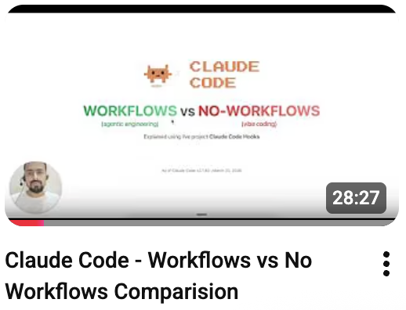

 
  

  

| | | |
|:--|:--|:--|
|  | **MS** Computer Science | NUCES FAST University |
|  | **BE** Computer Information Systems | NED University |

 

 

---

<h2>🤝 Social Stats & Let's Connect</h2>

&nbsp;&nbsp;
&nbsp;&nbsp;
&nbsp;&nbsp;
&nbsp;&nbsp;
&nbsp;&nbsp;

---

<h2> Recent Activity</h2>

<h3> Reddit (147)</h3>

**Latest**

| S# | Post | Subreddit |
|--:|:--|:--|
| 162 | Boris Cherny (creator of CC) complete thread - anthropic bans subscription on 3rd party usage | [/ClaudeAI](https://www.reddit.com/r/ClaudeAI/comments/1sc5fj9/boris_cherny_creator_of_cc_complete_thread) ( • 35) |
| 161 | Peter Steinberger (OpenClaw Creator) credits Boris Cherny (Claude Code Creator) amid anthropic subscription ban for using openclaw - Complete Thread | [/Anthropic](https://www.reddit.com/r/Anthropic/comments/1sc4gx7/peter_steinberger_openclaw_creator_credits_boris) (38K • 29) [/ArtificialInteligence](https://www.reddit.com/r/ArtificialInteligence/comments/1sc720i/peter_steinberger_openclaw_creator_credits_boris) (10K • 3) [/ChatGPT](https://www.reddit.com/r/ChatGPT/comments/1sc4f45/peter_steinberger_openclaw_creator_credits_boris) (4.2K • 3) [/LocalLLaMA](https://www.reddit.com/r/LocalLLaMA/comments/1sc7oui/peter_steinberger_openclaw_creator_credits_boris) (1.3K • 2) [/ClaudeCode](https://www.reddit.com/r/ClaudeCode/comments/1sc4pzw/peter_steinberger_openclaw_creator_credits_boris) (725 • 0) [/vibecoding](https://www.reddit.com/r/vibecoding/comments/1sc7fsk/peter_steinberger_openclaw_creator_credits_boris) (147 • 0) [/SaaS](https://www.reddit.com/r/SaaS/comments/1sc7yk8/peter_steinberger_openclaw_creator_credits_boris) (75 • 1) |
| 159 | Claude all 27 Hooks lifecycle explained | [/ClaudeAI](https://www.reddit.com/r/ClaudeAI/comments/1sc20m8/claude_all_27_hooks_lifecycle_explained) (2.1K • 0) [/Anthropic](https://www.reddit.com/r/Anthropic/comments/1sc21u6/claude_all_27_hooks_lifecycle_explained) (522 • 1) [/ClaudeCode](https://www.reddit.com/r/ClaudeCode/comments/1sc21hv/claude_all_27_hooks_lifecycle_explained) (496 • 1) |
| 158 | if you have just started using Codex CLI, codex-cli-best-practice is your ultimate guide | [/codex](https://www.reddit.com/r/codex/comments/1sc1q9w/if_you_have_just_started_using_codex_cli) (2.7K • 0) [/OpenAI](https://www.reddit.com/r/OpenAI/comments/1sc1xd4/if_you_have_just_started_using_codex_cli) (2.1K • 1) [/ChatGPT](https://www.reddit.com/r/ChatGPT/comments/1sc1xmn/if_you_have_just_started_using_codex_cli) (644 • 1) [/developersPak](https://www.reddit.com/r/developersPak/comments/1sc5n96/if_you_have_just_started_using_codex_cli) (170 • 0) |

**Most Viewed**

| S# | Post | Subreddit |
|--:|:--|:--|
| 110 | 15 New Claude Code Hidden Features from Boris Cherny (creator of CC) on 30 Mar 2026 | [/ClaudeAI](https://www.reddit.com/r/ClaudeAI/comments/1s7j9f2/15_new_claude_code_hidden_features_from_boris) ( • ) [/Anthropic](https://www.reddit.com/r/Anthropic/comments/1s7jbjl/15_new_claude_code_hidden_features_from_boris) (4K • 1) [/Anthropic](https://www.reddit.com/r/Anthropic/comments/1sa9m9e/15_new_claude_code_hidden_features_from_boris) (1.8K • 1) [/ClaudeCode](https://www.reddit.com/r/ClaudeCode/comments/1s7jajg/15_new_claude_code_hidden_features_from_boris) (1.6K • 0) [/ClaudeCode](https://www.reddit.com/r/ClaudeCode/comments/1s9dmg3/15_new_claude_code_hidden_features_from_boris) (1.2K • 0) [/vibecoding](https://www.reddit.com/r/vibecoding/comments/1s9i3v9/15_new_claude_code_hidden_features_from_boris) (466 • 1) |
| 63 | 5 claude code worktree tips from creator of claude code in feb 2026 | [/ClaudeCode](https://www.reddit.com/r/ClaudeCode/comments/1rae7sa/5_claude_code_worktree_tips_from_creator_of) ( • ) [/ClaudeAI](https://www.reddit.com/r/ClaudeAI/comments/1rae05r/5_claude_code_worktree_tips_from_creator_of) ( • 39) [/Anthropic](https://www.reddit.com/r/Anthropic/comments/1raeszd/5_claude_code_worktree_tips_from_creator_of) (6.6K • 0) [/vibecoding](https://www.reddit.com/r/vibecoding/comments/1raeoop/5_claude_code_worktree_tips_from_creator_of) (777 • 0) |
| 94 | claude-code-best-practice hits GitHub Trending (Monthly) with 15,000★ | [/ClaudeCode](https://www.reddit.com/r/ClaudeCode/comments/1rsls8b/claudecodebestpractice_hits_github_trending) ( • ) [/ClaudeAI](https://www.reddit.com/r/ClaudeAI/comments/1rsyfdz/claudecodebestpractice_hits_github_trending) ( • 23) [/developersPak](https://www.reddit.com/r/developersPak/comments/1rsyyrd/repo_claudecodebestpractice_hits_github_trending) (6.7K • 2) [/pakistan](https://www.reddit.com/r/pakistan/comments/1rt60bm/repo_claudecodebestpractice_hits_github_trending) (4.2K • 5) [/brdev](https://www.reddit.com/r/brdev/comments/1rt6ol9/claudecodebestpractice_hits_github_trending) (1.8K • 1) [/Anthropic](https://www.reddit.com/r/Anthropic/comments/1rt69lu/claudecodebestpractice_hits_github_trending) (1.5K • 0) [/claude](https://www.reddit.com/r/claude/comments/1rt6a6c/claudecodebestpractice_hits_github_trending) (845 • 1) [/karachi](https://www.reddit.com/r/karachi/comments/1rsyxoy/repo_claudecodebestpractice_hits_github_trending) (762 • 0) [/vibecoding](https://www.reddit.com/r/vibecoding/comments/1rslsj5/claudecodebestpractice_hits_github_trending) (323 • 0) |
| 2 | Claude Rules (./claude/rules/) are here | [/ClaudeAI](https://www.reddit.com/r/ClaudeAI/comments/1piuih6/comment/nti3x56) ( • ) [/ClaudeCode](https://www.reddit.com/r/ClaudeCode/comments/1pius01/claude_rules_clauderules_are_here) ( • ) |
| 64 | On this day last year, coding changed forever. Happy 1st birthday, Claude Code. 🎂🎉 | [/ClaudeAI](https://www.reddit.com/r/ClaudeAI/comments/1rcfac5/on_this_day_last_year_coding_changed_forever) ( • ) [/Anthropic](https://www.reddit.com/r/Anthropic/comments/1rcffe6/on_this_day_last_year_coding_changed_forever) (6.5K • 3) [/ClaudeCode](https://www.reddit.com/r/ClaudeCode/comments/1rcfdqj/on_this_day_last_year_coding_changed_forever) (800 • 0) |

<a href="reports/reddit.md"><b>See Complete List &rarr;</b></a>

&nbsp;&nbsp;&nbsp;&nbsp;&nbsp;&nbsp;

<h3> Github (27)</h3>

| S# | Repository | ★ |
|--:|:--|:--|
| 1 | [claude-code-best-practice](https://github.com/shanraisshan/claude-code-best-practice) |  |
| 2 | [codex-cli-best-practice](https://github.com/shanraisshan/codex-cli-best-practice) |  |
| 3 | [claude-code-hooks](https://github.com/shanraisshan/claude-code-hooks) |  |
| 4 | [EmojiCodeSheet](https://github.com/shanraisshan/EmojiCodeSheet) |  |
| 5 | [Refactoring-Android-App-Series-Overview](https://github.com/shanraisshan/Refactoring-Android-App-Series-Overview) |  |
| 6 | [claude-code-status-line](https://github.com/shanraisshan/claude-code-status-line) |  |
| 7 | [codex-cli-hooks](https://github.com/shanraisshan/codex-cli-hooks) |  |
| 8 | [novel-llm-26](https://github.com/shanraisshan/novel-llm-26) |  |
| 9 | [claude-code-codex-cursor-gemini](https://github.com/shanraisshan/claude-code-codex-cursor-gemini) |  |
| 10 | [claude-code-multi-agent-orchestrartion](https://github.com/shanraisshan/claude-code-multi-agent-orchestrartion) |  |
| 11 | [Notes](https://github.com/shanraisshan/notes) |  |
| 12 | [claude-agent-sdk-vs-claude-code-cli](https://github.com/shanraisshan/claude-agent-sdk-vs-claude-code-cli) |  |
| 13 | [mcp-weather](https://github.com/shanraisshan/mcp-weather) |  |

&nbsp;&nbsp;&nbsp;&nbsp;&nbsp;&nbsp;

<h3> LinkedIn (1)</h3>

1- How do I get ★ on my repo? Answer: Consistency + Reddit - [Link](https://www.linkedin.com/posts/shanraisshan_how-do-i-get-on-my-repo-answer-%F0%9D%97%96%F0%9D%97%BC%F0%9D%97%BB-activity-7445123568352505856-I1-t/)

&nbsp;&nbsp;&nbsp;&nbsp;&nbsp;&nbsp;

<h3> Videos (6)</h3>

