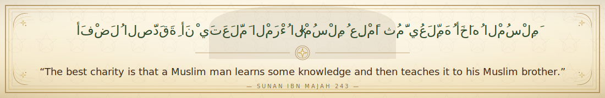

 

 &nbsp;&nbsp;
  

  

<h3>🎓 Education</h3>

| Degree | University | Year |
|:--|:--|:--|
| **MS** Computer Science | NUCES FAST University | 2019 |
| **BE** Computer Information Systems | NED University | 2014 |

<h3>📚 Courses</h3>

<h3>🏆 Achievements</h3>

 

<h3>🤝 Connect</h3>

<table align="center" cellspacing="0" cellpadding="0"><tr>
<td align="center" style="padding:0"> </td>
<td align="center" style="padding:0"> </td>
<td align="center" style="padding:0"> </td>
<td align="center" style="padding:0"> </td>
<td align="center" style="padding:0"> </td>
<td align="center" style="padding:0"> </td>
</tr></table>

---

<h2> Recent Activity</h2>

<h3> Reddit (157)</h3>

**Latest**

| S# | Post | Subreddit |
|--:|:--|:--|
| 177 | Opus 4.7 says "strawperrry" has 3 p's — until you ask "how?" | [/ChatGPT](https://www.reddit.com/r/ChatGPT/comments/1so42mr/opus_47_says_strawperrry_has_3_ps_until_you_ask/) (6.9K • 6) [/ClaudeAI](https://www.reddit.com/r/ClaudeAI/comments/1so1lq6/opus_47_says_strawperrry_has_3_ps_until_you_ask/) (4.9K • 9) [/OpenAI](https://www.reddit.com/r/OpenAI/comments/1so43ce/opus_47_says_strawperrry_has_3_ps_until_you_ask/) (4.7K • 1) [/ClaudeCode](https://www.reddit.com/r/ClaudeCode/comments/1so1o3y/opus_47_says_strawperrry_has_3_ps_until_you_ask/) (2.6K • 6) [/ArtificialInteligence](https://www.reddit.com/r/ArtificialInteligence/comments/1so3wdc/opus_47_says_strawperrry_has_3_ps_until_you_ask/) (2.6K • 5) [/Anthropic](https://www.reddit.com/r/Anthropic/comments/1so1q4t/opus_47_says_strawperrry_has_3_ps_until_you_ask/) (1.5K • 2) [/GeminiAI](https://www.reddit.com/r/GeminiAI/comments/1so3v8s/opus_47_says_strawperrry_has_3_ps_until_you_ask/) (793 • 1) [/vibecoding](https://www.reddit.com/r/vibecoding/comments/1so1th0/opus_47_says_strawperrry_has_3_ps_until_you_ask/) (317 • 0) |
| 176 | Hello Opus 4.7, you are are thinking way extra high! | [/OpenAI](https://www.reddit.com/r/OpenAI/comments/1snswb9/hello_opus_47_you_are_are_thinking_way_extra_high/) ( • 23) [/ClaudeAI](https://www.reddit.com/r/ClaudeAI/comments/1snrw2c/hello_opus_47_you_are_are_thinking_way_extra_high/) ( • 47) [/codex](https://www.reddit.com/r/codex/comments/1so44zr/hello_opus_47_you_are_are_thinking_way_extra_high/) (37K • 13) [/ChatGPT](https://www.reddit.com/r/ChatGPT/comments/1snub6y/hello_opus_47_you_are_are_thinking_way_extra_high/) (20K • 3) [/ArtificialInteligence](https://www.reddit.com/r/ArtificialInteligence/comments/1snudz2/hello_opus_47_you_are_are_thinking_way_extra_high/) (8.7K • 2) [/Anthropic](https://www.reddit.com/r/Anthropic/comments/1sns1fp/hello_opus_47_you_are_are_thinking_way_extra_high/) (1.2K • 0) [/GeminiAI](https://www.reddit.com/r/GeminiAI/comments/1snumj9/hello_opus_47_you_are_are_thinking_way_extra_high/) (863 • 0) [/ClaudeCode](https://www.reddit.com/r/ClaudeCode/comments/1snry8f/hello_opus_47_you_are_are_thinking_way_extra_high/) (704 • 0) [/vibecoding](https://www.reddit.com/r/vibecoding/comments/1snrzf9/hello_opus_47_you_are_are_thinking_way_extra_high/) (303 • 0) |
| 175 | 06 New Claude Code Tips from Boris Cherny (creator of CC) after Opus 4.7 release | [/ClaudeAI](https://www.reddit.com/r/ClaudeAI/comments/1snn4ed/06_new_claude_code_tips_from_boris_cherny_creator/) ( • ) [/ClaudeCode](https://www.reddit.com/r/ClaudeCode/comments/1snn6vz/06_new_claude_code_tips_from_boris_cherny_creator/) (4.5K • 1) [/Anthropic](https://www.reddit.com/r/Anthropic/comments/1snn7b1/06_new_claude_code_tips_from_boris_cherny_creator/) (990 • 2) |
| 174 | I built a self-evolving agentic loop that ran 104 iterations autonomously to find questions that break every LLM — here's the architecture | [/ClaudeAI](https://www.reddit.com/r/ClaudeAI/comments/1smy965/i_built_a_selfevolving_agentic_loop_that_ran_104/) (6.2K • 4) [/ClaudeCode](https://www.reddit.com/r/ClaudeCode/comments/1smybjp/i_built_a_selfevolving_agentic_loop_that_ran_104/) (1.6K • 1) |

**Most Viewed**

| S# | Post | Subreddit |
|--:|:--|:--|
| 110 | 15 New Claude Code Hidden Features from Boris Cherny (creator of CC) on 30 Mar 2026 | [/ClaudeAI](https://www.reddit.com/r/ClaudeAI/comments/1s7j9f2/15_new_claude_code_hidden_features_from_boris) ( • ) [/Anthropic](https://www.reddit.com/r/Anthropic/comments/1s7jbjl/15_new_claude_code_hidden_features_from_boris) (4K • 1) [/Anthropic](https://www.reddit.com/r/Anthropic/comments/1sa9m9e/15_new_claude_code_hidden_features_from_boris) (2K • 1) [/ClaudeCode](https://www.reddit.com/r/ClaudeCode/comments/1s7jajg/15_new_claude_code_hidden_features_from_boris) (1.6K • 0) [/ClaudeCode](https://www.reddit.com/r/ClaudeCode/comments/1s9dmg3/15_new_claude_code_hidden_features_from_boris) (1.2K • 0) [/vibecoding](https://www.reddit.com/r/vibecoding/comments/1s9i3v9/15_new_claude_code_hidden_features_from_boris) (470 • 1) |
| 175 | 06 New Claude Code Tips from Boris Cherny (creator of CC) after Opus 4.7 release | [/ClaudeAI](https://www.reddit.com/r/ClaudeAI/comments/1snn4ed/06_new_claude_code_tips_from_boris_cherny_creator/) ( • ) [/ClaudeCode](https://www.reddit.com/r/ClaudeCode/comments/1snn6vz/06_new_claude_code_tips_from_boris_cherny_creator/) (4.5K • 1) [/Anthropic](https://www.reddit.com/r/Anthropic/comments/1snn7b1/06_new_claude_code_tips_from_boris_cherny_creator/) (990 • 2) |
| 167 | Claude Code v2.1.92 introduces Ultraplan — draft plans in the cloud, review in your browser, execute anywhere | [/ClaudeAI](https://www.reddit.com/r/ClaudeAI/comments/1se1kpr/claude_code_v2192_introduces_ultraplan_draft/) ( • ) [/Anthropic](https://www.reddit.com/r/Anthropic/comments/1se33jw/claude_code_v2192_introduces_ultraplan_draft/) (3.6K • 1) [/ClaudeCode](https://www.reddit.com/r/ClaudeCode/comments/1se32yw/claude_code_v2192_introduces_ultraplan_draft/) (1.3K • 0) |
| 162 | Boris Cherny (creator of CC) complete thread - anthropic bans subscription on 3rd party usage | [/ClaudeAI](https://www.reddit.com/r/ClaudeAI/comments/1sc5fj9/boris_cherny_creator_of_cc_complete_thread) ( • ) |
| 63 | 5 claude code worktree tips from creator of claude code in feb 2026 | [/ClaudeCode](https://www.reddit.com/r/ClaudeCode/comments/1rae7sa/5_claude_code_worktree_tips_from_creator_of) ( • ) [/ClaudeAI](https://www.reddit.com/r/ClaudeAI/comments/1rae05r/5_claude_code_worktree_tips_from_creator_of) ( • 39) [/Anthropic](https://www.reddit.com/r/Anthropic/comments/1raeszd/5_claude_code_worktree_tips_from_creator_of) (6.6K • 0) [/vibecoding](https://www.reddit.com/r/vibecoding/comments/1raeoop/5_claude_code_worktree_tips_from_creator_of) (778 • 0) |

&nbsp;&nbsp;&nbsp;&nbsp;&nbsp;&nbsp;

<h3> Github (27)</h3>

| S# | Repository | ★ |
|--:|:--|:--|
| 1 | [claude-code-best-practice](https://github.com/shanraisshan/claude-code-best-practice) |  |
| 2 | [codex-cli-best-practice](https://github.com/shanraisshan/codex-cli-best-practice) |  |
| 3 | [claude-code-hooks](https://github.com/shanraisshan/claude-code-hooks) |  |
| 4 | [EmojiCodeSheet](https://github.com/shanraisshan/EmojiCodeSheet) |  |
| 5 | [Refactoring-Android-App-Series-Overview](https://github.com/shanraisshan/Refactoring-Android-App-Series-Overview) |  |
| 6 | [claude-code-status-line](https://github.com/shanraisshan/claude-code-status-line) |  |
| 7 | [codex-cli-hooks](https://github.com/shanraisshan/codex-cli-hooks) |  |
| 8 | [novel-llm-26](https://github.com/shanraisshan/novel-llm-26) |  |
| 9 | [claude-code-codex-cursor-gemini](https://github.com/shanraisshan/claude-code-codex-cursor-gemini) |  |
| 10 | [claude-code-multi-agent-orchestrartion](https://github.com/shanraisshan/claude-code-multi-agent-orchestrartion) |  |
| 11 | [Notes](https://github.com/shanraisshan/notes) |  |
| 12 | [claude-agent-sdk-vs-claude-code-cli](https://github.com/shanraisshan/claude-agent-sdk-vs-claude-code-cli) |  |
| 13 | [mcp-weather](https://github.com/shanraisshan/mcp-weather) |  |

&nbsp;&nbsp;&nbsp;&nbsp;&nbsp;&nbsp;

<h3> LinkedIn (1)</h3>

1- How do I get ★ on my repo? Answer: Consistency + Reddit - [Link](https://www.linkedin.com/posts/shanraisshan_how-do-i-get-on-my-repo-answer-%F0%9D%97%96%F0%9D%97%BC%F0%9D%97%BB-activity-7445123568352505856-I1-t/)

&nbsp;&nbsp;&nbsp;&nbsp;&nbsp;&nbsp;

<h3> Videos (7)</h3>

<h3>🇵🇰 Most Starred Repos from Pakistan</h3>

| # | Repository | ★ |
|--:|:--|:--|
| 1 | [kamranahmedse/developer-roadmap](https://github.com/kamranahmedse/developer-roadmap) |  |
| 2 | [kamranahmedse/design-patterns-for-humans](https://github.com/kamranahmedse/design-patterns-for-humans) |  |
| 3 | [shanraisshan/claude-code-best-practice](https://github.com/shanraisshan/claude-code-best-practice) |  |

