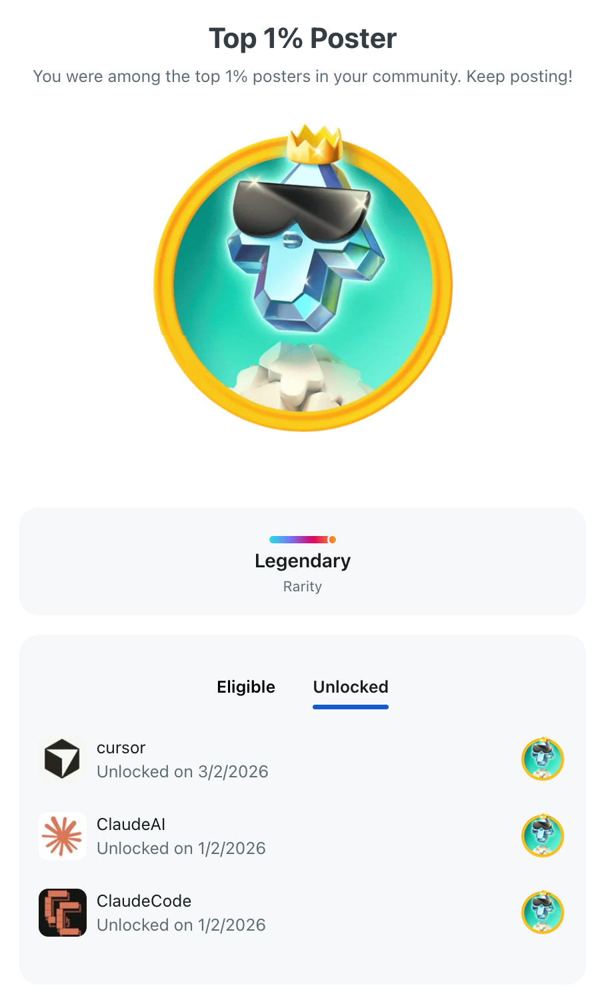

##  REDDIT (98)

| S# | Post | Subreddit |
|--:|:--|:--|
| 102 | Claude Code Hooks - all 23 explained and implemented | [/ClaudeAI](https://www.reddit.com/r/ClaudeAI/comments/1rxu41b/claude_code_hooks_all_23_explained_and_implemented/) (23K • 7) [/Anthropic](https://www.reddit.com/r/Anthropic/comments/1rxu5r3/claude_code_hooks_all_23_explained_and_implemented/) (1.1K • 2) [/ClaudeCode](https://www.reddit.com/r/ClaudeCode/comments/1rxu5ar/claude_code_hooks_all_23_explained_and_implemented/) (478 • 0) [/claude](https://www.reddit.com/r/claude/comments/1rxuaon/claude_code_hooks_all_23_explained_and_implemented/) (392 • 1) [/vibecoding](https://www.reddit.com/r/vibecoding/comments/1rxuaw5/claude_code_hooks_all_23_explained_and_implemented/) (178 • 0) |
| 101 | Why SessionStart fires on Prompt submission and not when session is starting? | [/codex](https://www.reddit.com/r/codex/comments/1rxu1sa/why_sessionstart_fires_on_prompt_submission_and/) (611 • 0) |
| 100 | Claude Code added 5 more hooks in last 12 days - makes it 23 | [/ClaudeAI](https://www.reddit.com/r/ClaudeAI/comments/1rx67xh/claude_code_added_5_more_hooks_in_last_12_days/) (4.3K • 9) [/ClaudeCode](https://www.reddit.com/r/ClaudeCode/comments/1rx6bzy/claude_code_added_5_more_hooks_in_last_12_days/) (702 • 0) |
| 99 | Codex CLI now has hooks support (beta) — SessionStart, Stop & notify | [/codex](https://www.reddit.com/r/codex/comments/1rw6j0o/codex_cli_now_has_hooks_support_beta_sessionstart/) (3.3K • 5) [/ClaudeCode](https://www.reddit.com/r/ClaudeCode/comments/1rw811v/codex_cli_now_has_hooks_support_beta_sessionstart/) (405 • 0) [/vibecoding](https://www.reddit.com/r/vibecoding/comments/1rw81g3/codex_cli_now_has_hooks_support_beta_sessionstart/) (207 • 0) |
| 98 | Claude Code vs Codex CLI — orchestration workflows side by side | [/ClaudeAI](https://www.reddit.com/r/ClaudeAI/comments/1rw2t3j/claude_code_vs_codex_cli_orchestration_workflows/) (6.7K • 5) [/Anthropic](https://www.reddit.com/r/Anthropic/comments/1rw2v8m/claude_code_vs_codex_cli_orchestration_workflows/) (3.3K • 5) [/codex](https://www.reddit.com/r/codex/comments/1rw2s28/claude_code_vs_codex_cli_orchestration_workflows/) (2.5K • 0) [/cursor](https://www.reddit.com/r/cursor/comments/1rw2xfd/claude_code_vs_codex_cli_orchestration_workflows/) (2.4K • 1) [/ClaudeCode](https://www.reddit.com/r/ClaudeCode/comments/1rw2unf/claude_code_vs_codex_cli_orchestration_workflows/) (480 • 0) [/claude](https://www.reddit.com/r/claude/comments/1rw2y2y/claude_code_vs_codex_cli_orchestration_workflows/) (436 • 0) [/vibecoding](https://www.reddit.com/r/vibecoding/comments/1rw2wpi/claude_code_vs_codex_cli_orchestration_workflows/) (192 • 0) |
| 97 | codex subagents are now the part of best practice repo | [/codex](https://www.reddit.com/r/codex/comments/1rw0t8g/codex_subagents_are_now_the_part_of_best_practice/) (8.5K • 3) |
| 96 | Reddit stops working in claude in chrome recently | [/ClaudeAI](https://www.reddit.com/r/ClaudeAI/comments/1ru9dlu/reddit_stops_working_in_claude_in_chrome_recently/) (2.1K • 2) [/ClaudeCode](https://www.reddit.com/r/ClaudeCode/comments/1ru9h6w/reddit_stops_working_in_claude_in_chrome_recently/) (1.8K • 3) |
| 95 | How can I test these 2 new hooks? | [/ClaudeAI](https://www.reddit.com/r/ClaudeAI/comments/1rt9w6x/how_can_i_test_these_2_new_hooks/) (1.2K • 1) [/ClaudeCode](https://www.reddit.com/r/ClaudeCode/comments/1rt9zpf/how_can_i_test_these_2_new_hooks/) (739 • 0) |
| 94 | claude-code-best-practice hits GitHub Trending (Monthly) with 15,000★ | [/ClaudeCode](https://www.reddit.com/r/ClaudeCode/comments/1rsls8b/claudecodebestpractice_hits_github_trending/) ( • 50) [/ClaudeAI](https://www.reddit.com/r/ClaudeAI/comments/1rsyfdz/claudecodebestpractice_hits_github_trending/) ( • 21) [/developersPak](https://www.reddit.com/r/developersPak/comments/1rsyyrd/repo_claudecodebestpractice_hits_github_trending/) (6.2K • 2) [/pakistan](https://www.reddit.com/r/pakistan/comments/1rt60bm/repo_claudecodebestpractice_hits_github_trending/) (4.2K • 5) [/brdev](https://www.reddit.com/r/brdev/comments/1rt6ol9/claudecodebestpractice_hits_github_trending/) (1.7K • 1) [/Anthropic](https://www.reddit.com/r/Anthropic/comments/1rt69lu/claudecodebestpractice_hits_github_trending/) (1.5K • 0) [/claude](https://www.reddit.com/r/claude/comments/1rt6a6c/claudecodebestpractice_hits_github_trending/) (829 • 1) [/karachi](https://www.reddit.com/r/karachi/comments/1rsyxoy/repo_claudecodebestpractice_hits_github_trending/) (732 • 0) [/vibecoding](https://www.reddit.com/r/vibecoding/comments/1rslsj5/claudecodebestpractice_hits_github_trending/) (318 • 0) |
| 93 | Agent Teams: One prompt, three teammates, a fully working CLI workflow | [/ClaudeAI](https://www.reddit.com/r/ClaudeAI/comments/1rrqwku/agent_teams_one_prompt_three_teammates_a_fully/) (2.1K • 0) [/ClaudeCode](https://www.reddit.com/r/ClaudeCode/comments/1rru0v9/agent_teams_one_prompt_three_teammates_a_fully/) (618 • 0) |
| 92 | What happen when you have agent, command and skill for same task? | [/ClaudeAI](https://www.reddit.com/r/ClaudeAI/comments/1rrnlvl/what_happen_when_you_have_agent_command_and_skill/) (4.4K • 2) [/ClaudeCode](https://www.reddit.com/r/ClaudeCode/comments/1rrno69/what_happen_when_you_have_agent_command_and_skill/) (552 • 2) |
| 91 | Soothing sound of mouse click during long running tasks | [/ClaudeAI](https://www.reddit.com/r/ClaudeAI/comments/1rr4zj0/soothing_sound_of_mouse_click_during_long_running/) (618 • 0) [/ClaudeCode](https://www.reddit.com/r/ClaudeCode/comments/1rr51hc/soothing_sound_of_mouse_click_during_long_running/) (326 • 0) |
| 90 | btw im ultrathinking to simplify the loop of these fast releases | [/ClaudeAI](https://www.reddit.com/r/ClaudeAI/comments/1rqgtlc/btw_im_ultrathinking_to_simplify_the_loop_of/) ( • ) [/ClaudeCode](https://www.reddit.com/r/ClaudeCode/comments/1rqguwt/btw_im_ultrathinking_to_simplify_the_loop_of/) (1.2K • 1) |
| 89 | 24 Tips & Tricks for Codex CLI + Resources from the Codex Team | [/codex](https://www.reddit.com/r/codex/comments/1rn6wpf/24_tips_tricks_for_codex_cli_resources_from_the/) (4.8K • 1) [/ClaudeCode](https://www.reddit.com/r/ClaudeCode/comments/1rnwzw2/24_tips_tricks_for_codex_cli_resources_from_the/) (676 • 0) [/vibecoding](https://www.reddit.com/r/vibecoding/comments/1rnx09p/24_tips_tricks_for_codex_cli_resources_from_the/) (288 • 0) |
| 88 | Run a prompt or slash command on a recurring interval | [/ClaudeAI](https://www.reddit.com/r/ClaudeAI/comments/1rmw2k2/run_a_prompt_or_slash_command_on_a_recurring/) (2.2K • 1) [/ClaudeCode](https://www.reddit.com/r/ClaudeCode/comments/1rmwe8f/run_a_prompt_or_slash_command_on_a_recurring/) (948 • 0) |
| 87 | Tips & Tricks from 10,000+★ repo claude-code-best-practice | [/ClaudeAI](https://www.reddit.com/r/ClaudeAI/comments/1rm0eqo/tips_tricks_from_10000_repo_claudecodebestpractice/) (9K • 6) [/Anthropic](https://www.reddit.com/r/Anthropic/comments/1rm10bq/tips_tricks_from_10000_repo_claudecodebestpractice/) (2K • 0) [/ClaudeCode](https://www.reddit.com/r/ClaudeCode/comments/1rm0fmt/tips_tricks_from_10000_repo_claudecodebestpractice/) (1.2K • 0) [/developersPak](https://www.reddit.com/r/developersPak/comments/1rm2f2m/tips_tricks_from_10000_repo_claudecodebestpractice/) (955 • 0) [/vibecoding](https://www.reddit.com/r/vibecoding/comments/1rm0o8n/tips_tricks_from_10000_repo_claudecodebestpractice/) (884 • 1) [/AIAssisted](https://www.reddit.com/r/AIAssisted/comments/1rmxh6l/tips_tricks_from_10000_repo_claudecodebestpractice/) (386 • 0) [/developersIndia](https://www.reddit.com/r/developersIndia/comments/1rm2g90/tips_tricks_from_10000_repo_claudecodebestpractice/) (29 • 0) |
| 86 | why model degradations happen? | [/codex](https://www.reddit.com/r/codex/comments/1rlhirc/why_model_degradation_happens/) (19K • 18) [/ClaudeAI](https://www.reddit.com/r/ClaudeAI/comments/1rlhi83/why_model_degradations_happen/) (11K • 13) [/cursor](https://www.reddit.com/r/cursor/comments/1rlhlyj/why_model_degradations_happen/) (11K • 5) [/ClaudeCode](https://www.reddit.com/r/ClaudeCode/comments/1rlhlmu/why_model_degradations_happen/) (675 • 0) |
| 85 | Billion-Dollar Questions of AI Agentic Engineering — looking for concrete answers, not vibes | [/ClaudeCode](https://www.reddit.com/r/ClaudeCode/comments/1rlfm30/billiondollar_questions_of_ai_agentic_engineering/) (5.6K • 3) [/ClaudeAI](https://www.reddit.com/r/ClaudeAI/comments/1rlfkj2/billiondollar_questions_of_ai_agentic_engineering/) (3.2K • 6) |
| 84 | Claude code opus 4.6 for Plan + Implementation, Codex gpt 5.3 for review both | [/codex](https://www.reddit.com/r/codex/comments/1rlc1zg/claude_code_opus_46_for_plan_implementation_codex/) (12K • 12) [/ChatGPTPro](https://www.reddit.com/r/ChatGPTPro/comments/1rlc4ic/claude_code_opus_46_for_plan_implementation_codex/) (6.8K • 3) [/ClaudeAI](https://www.reddit.com/r/ClaudeAI/comments/1rlc147/claude_code_opus_46_for_plan_implementation_codex/) (1.9K • 0) [/ClaudeCode](https://www.reddit.com/r/ClaudeCode/comments/1rlc2wd/claude_code_opus_46_for_plan_implementation_codex/) (606 • 0) [/vibecoding](https://www.reddit.com/r/vibecoding/comments/1rlc2i3/claude_code_opus_46_for_plan_implementation_codex/) (176 • 0) |
| 83 | Everything I Wish Existed When I Started Using Codex CLI — So I Built It | [/codex](https://www.reddit.com/r/codex/comments/1rkgkx9/everything_i_wish_existed_when_i_started_using/) ( • 15) [/ChatGPTPro](https://www.reddit.com/r/ChatGPTPro/comments/1rkgqko/everything_i_wish_existed_when_i_started_using/) (12K • 1) [/ChatGPT](https://www.reddit.com/r/ChatGPT/comments/1rkgpbz/everything_i_wish_existed_when_i_started_using/) (1.6K • 3) [/OpenAI](https://www.reddit.com/r/OpenAI/comments/1rkgq47/everything_i_wish_existed_when_i_started_using/) (1.6K • 0) [/ClaudeCode](https://www.reddit.com/r/ClaudeCode/comments/1rlaeg1/everything_i_wish_existed_when_i_started_using/) (473 • 0) [/AiBuilders](https://www.reddit.com/r/AiBuilders/comments/1rlafuz/everything_i_wish_existed_when_i_started_using/) (293 • 0) [/vibecoding](https://www.reddit.com/r/vibecoding/comments/1rkglkg/everything_i_wish_existed_when_i_started_using/) (220 • 0) |
| 82 | Found 3 unreleased Claude Code hooks in v2.1.64 — InstructionsLoaded is in the changelog, Elicitation & ElicitationResult are hiding in the schema | [/ClaudeCode](https://www.reddit.com/r/ClaudeCode/comments/1rkf9m9/found_3_unreleased_claude_code_hooks_in_v2164/) (10K • 12) |
| 81 | I'm curating a list of startups/products that Claude Code killed by shipping their features natively | [/ClaudeAI](https://www.reddit.com/r/ClaudeAI/comments/1rjy931/im_curating_a_list_of_startupsproducts_that/) (6.5K • 7) [/ClaudeCode](https://www.reddit.com/r/ClaudeCode/comments/1rjyd1o/im_curating_a_list_of_startupsproducts_that/) (2.7K • 2) [/Anthropic](https://www.reddit.com/r/Anthropic/comments/1rjydyf/im_curating_a_list_of_startupsproducts_that/) (1.4K • 1) |
| 80 | Claude just launched Voice Mode (/voice) — and it perfectly complements our open-source Voice Hooks for Claude Code CLI | [/ClaudeAI](https://www.reddit.com/r/ClaudeAI/comments/1rjjici/claude_just_launched_voice_mode_voice_and_it/) (28K • 12) [/claude](https://www.reddit.com/r/claude/comments/1rjjxjw/claude_just_launched_voice_mode_voice_and_it/) (947 • 1) |
| 79 | Claude Code has changed engineering at inside Ramp, Rakuten, Brex, Wiz, Shopify, and Spotify | [/ClaudeCode](https://www.reddit.com/r/ClaudeCode/comments/1rjhyn3/claude_code_has_changed_engineering_at_inside/) ( • 41) [/Anthropic](https://www.reddit.com/r/Anthropic/comments/1rjhyx1/claude_code_has_changed_engineering_at_inside/) (2.3K • 0) |
| 78 | Claude voice + voice hooks will be a 20x productivity boost | [/ClaudeCode](https://www.reddit.com/r/ClaudeCode/comments/1rjgr6n/claude_voice_voice_hooks_will_be_a_20x/) (2.2K • 3) [/Anthropic](https://www.reddit.com/r/Anthropic/comments/1rji0ks/claude_voice_voice_hooks_will_be_a_20x/) (1.4K • 0) [/vibecoding](https://www.reddit.com/r/vibecoding/comments/1rjgsbm/claude_voice_voice_hooks_will_be_a_20x/) (383 • 0) [/ClaudeAI](https://www.reddit.com/r/ClaudeAI/comments/1rjhsup/claude_voice_voice_hooks_will_be_a_20x/) (0 • 1) |
| 77 | Anthropic Prompt Engineering repo still relevant after 2 years? | [/ClaudeCode](https://www.reddit.com/r/ClaudeCode/comments/1rivrod/anthropic_prompt_engineering_repo_still_relevant/) (3.7K • 3) [/ClaudeAI](https://www.reddit.com/r/ClaudeAI/comments/1rivp8j/anthropic_prompt_engineering_repo_still_relevant/) (2.1K • 0) [/Anthropic](https://www.reddit.com/r/Anthropic/comments/1rivsaa/anthropic_prompt_engineering_repo_still_relevant/) (1.4K • 0) |
| 76 | I gave Codex CLI a voice so it tells me when it's done instead of me watching like a hawk | [/ChatGPTPro](https://www.reddit.com/r/ChatGPTPro/comments/1rgvzi2/i_gave_codex_cli_a_voice_so_it_tells_me_when_its/) (11K • 5) [/codex](https://www.reddit.com/r/codex/comments/1rgvxqd/i_gave_codex_cli_a_voice_so_it_tells_me_when_its/) (2.4K • 2) [/ChatGPT](https://www.reddit.com/r/ChatGPT/comments/1rgvwnz/i_gave_codex_cli_a_voice_so_it_tells_me_when_its/) (1.6K • 1) [/OpenAI](https://www.reddit.com/r/OpenAI/comments/1rgw0w1/i_gave_codex_cli_a_voice_so_it_tells_me_when_its/) (1.5K • 0) [/ChatGPTcomplaints](https://www.reddit.com/r/ChatGPTcomplaints/comments/1rgw5y8/i_gave_codex_cli_a_voice_so_it_tells_me_when_its/) (799 • 0) [/vibecoding](https://www.reddit.com/r/vibecoding/comments/1rgw0ap/i_gave_codex_cli_a_voice_so_it_tells_me_when_its/) (331 • 0) [/cursor](https://www.reddit.com/r/cursor/comments/1rgw6m2/i_gave_codex_cli_a_voice_so_it_tells_me_when_its/) (0 • 1) |
| 75 | Do "Senior/Junior Engineer" roles in Agent's system prompts actually improve results, or just change tone? | [/ClaudeAI](https://www.reddit.com/r/ClaudeAI/comments/1riqd9t/do_seniorjunior_engineer_roles_in_agents_system/) (45K • 22) [/ClaudeCode](https://www.reddit.com/r/ClaudeCode/comments/1riqfwc/do_seniorjunior_engineer_roles_in_agents_system/) (4.8K • 5) [/OpenAI](https://www.reddit.com/r/OpenAI/comments/1rfz41h/do_seniorjunior_engineer_roles_in_agents_system/) (2.9K • 2) [/vibecoding](https://www.reddit.com/r/vibecoding/comments/1rfz4sv/do_seniorjunior_engineer_roles_in_agents_system/) (203 • 0) |
| 74 | Claude Code Best Practice hits 5000★ today | [/ClaudeCode](https://www.reddit.com/r/ClaudeCode/comments/1rfxsfv/claude_code_best_practice_hits_5000_today/) ( • 17) [/claude](https://www.reddit.com/r/claude/comments/1rfxuya/claude_code_best_practice_hits_5000_today/) (2.3K • 3) [/Anthropic](https://www.reddit.com/r/Anthropic/comments/1rfxudj/claude_code_best_practice_hits_5000_today/) (1.9K • 0) [/ClaudeAI](https://www.reddit.com/r/ClaudeAI/comments/1rg02uv/claude_code_best_practice_hits_5000_today/) (1.8K • 0) [/vibecoding](https://www.reddit.com/r/vibecoding/comments/1rfxtjs/claude_code_best_practice_hits_5000_today/) (358 • 0) |
| 73 | Claude Code Memory is here | [/ClaudeCode](https://www.reddit.com/r/ClaudeCode/comments/1rft896/claude_code_memory_is_here/) ( • ) [/vibecoding](https://www.reddit.com/r/vibecoding/comments/1rftany/claude_code_memory_is_here/) (250 • 0) |
| 72 | What are your SECRET SAUCE for agents, MCPs, commands & skills? Please share! | [/ClaudeCode](https://www.reddit.com/r/ClaudeCode/comments/1rfjz1p/what_are_your_secret_sauce_for_agents_mcps/) (2.9K • 6) |
| 71 | The third era of AI software development | [/cursor](https://www.reddit.com/r/cursor/comments/1rfi6zc/the_third_era_of_ai_software_development/) ( • ) |
| 70 | Claude in Chrome MCP vs Agent Browser (Vercel) Skill. | [/ClaudeAI](https://www.reddit.com/r/ClaudeAI/comments/1rfa2py/claude_in_chrome_mcp_vs_agent_browser_vercel_skill/) (6.2K • 5) [/mcp](https://www.reddit.com/r/mcp/comments/1rfa5od/claude_in_chrome_mcp_vs_agent_browser_vercel_skill/) (1.5K • 1) [/ClaudeCode](https://www.reddit.com/r/ClaudeCode/comments/1rfa61r/claude_in_chrome_mcp_vs_agent_browser_vercel_skill/) (753 • 0) |
| 69 | Claude Code: Usage, Rate Limits & Extra Usage | [/ClaudeCode](https://www.reddit.com/r/ClaudeCode/comments/1rf2k5r/claude_code_usage_rate_limits_extra_usage/) (1.2K • 0) |
| 68 | BOSS Level of Spec Driven Development (SDD) by creator of claude code (Boris) | [/ClaudeAI](https://www.reddit.com/r/ClaudeAI/comments/1re41t7/boss_level_of_spec_driven_development_sdd_by/) (2K • 1) [/ClaudeCode](https://www.reddit.com/r/ClaudeCode/comments/1re4il6/boss_level_of_spec_driven_development_sdd_by/) (913 • 0) |
| 67 | No AGENTS.md → baseline. Bad AGENTS.md → worse. Good AGENTS.md → better. The file isn't the problem, your writing is. | [/OpenAI](https://www.reddit.com/r/OpenAI/comments/1rd94in/no_agentsmd_baseline_bad_agentsmd_worse_good/) (17K • 10) [/cursor](https://www.reddit.com/r/cursor/comments/1rd94wr/no_agentsmd_baseline_bad_agentsmd_worse_good/) (8.9K • 9) |
| 66 | No CLAUDE.md → baseline. Bad CLAUDE.md → worse. Good CLAUDE.md → better. The file isn't the problem, your writing is. | [/ClaudeAI](https://www.reddit.com/r/ClaudeAI/comments/1rd93ho/no_claudemd_baseline_bad_claudemd_worse_good/) ( • ) [/ClaudeCode](https://www.reddit.com/r/ClaudeCode/comments/1rd957e/no_claudemd_baseline_bad_claudemd_worse_good/) (1.8K • 2) |
| 65 | ELI5 - Anthropic vs DeepSeek, Moonshot AI, and MiniMax | [/ClaudeAI](https://www.reddit.com/r/ClaudeAI/comments/1rd7nw2/eli5_anthropic_vs_deepseek_moonshot_ai_and_minimax/) (5.7K • 2) [/Anthropic](https://www.reddit.com/r/Anthropic/comments/1rd7r9a/eli5_anthropic_vs_deepseek_moonshot_ai_and_minimax/) (2K • 0) |
| 64 | On this day last year, coding changed forever. Happy 1st birthday, Claude Code. 🎂🎉 | [/ClaudeAI](https://www.reddit.com/r/ClaudeAI/comments/1rcfac5/on_this_day_last_year_coding_changed_forever/) ( • ) [/Anthropic](https://www.reddit.com/r/Anthropic/comments/1rcffe6/on_this_day_last_year_coding_changed_forever/) (6.5K • 3) [/ClaudeCode](https://www.reddit.com/r/ClaudeCode/comments/1rcfdqj/on_this_day_last_year_coding_changed_forever/) (790 • 0) |
| 63 | 5 claude code worktree tips from creator of claude code in feb 2026 | [/ClaudeCode](https://www.reddit.com/r/ClaudeCode/comments/1rae7sa/5_claude_code_worktree_tips_from_creator_of/) ( • ) [/ClaudeAI](https://www.reddit.com/r/ClaudeAI/comments/1rae05r/5_claude_code_worktree_tips_from_creator_of/) ( • 39) [/Anthropic](https://www.reddit.com/r/Anthropic/comments/1raeszd/5_claude_code_worktree_tips_from_creator_of/) (6.6K • 0) [/vibecoding](https://www.reddit.com/r/vibecoding/comments/1raeoop/5_claude_code_worktree_tips_from_creator_of/) (772 • 0) |
| 62 | Claude code added 3 hooks in 2 days (18 hooks in total) | [/ClaudeCode](https://www.reddit.com/r/ClaudeCode/comments/1rafr28/claude_code_added_3_hooks_in_2_days_18_hooks_in/) (2.5K • 1) |
| 61 | Claude added 16th hook (Config Change) in latest v2.1.49 update | [/ClaudeCode](https://www.reddit.com/r/ClaudeCode/comments/1ra5p82/claude_added_16th_hook_config_change_in_latest/) (1.1K • 0) |
| 60 | Claude Code Security 👮 is here | [/ClaudeAI](https://www.reddit.com/r/ClaudeAI/comments/1ra2pla/claude_code_security_is_here/) ( • ) [/ClaudeCode](https://www.reddit.com/r/ClaudeCode/comments/1ra32e4/claude_code_security_is_here/) (595 • 0) |
| 59 | Start claude with your specific agent | [/ClaudeAI](https://www.reddit.com/r/ClaudeAI/comments/1r9uwnn/start_claude_with_your_specific_agent/) (1.2K • 0) [/ClaudeCode](https://www.reddit.com/r/ClaudeCode/comments/1r9va3f/start_claude_with_your_specific_agent/) (671 • 0) |
| 58 | Can I use my Claude Max subscription with the Agent SDK for personal use? | [/ClaudeAI](https://www.reddit.com/r/ClaudeAI/comments/1r8qvae/can_i_use_my_claude_max_subscription_with_the/) (21K • 11) [/ClaudeCode](https://www.reddit.com/r/ClaudeCode/comments/1r8r02c/can_i_use_my_claude_max_subscription_with_the/) (949 • 0) |
| 57 | Claude's Programmatic Tool Calling is now GA — 37% fewer tokens by pre-baking decision paths in code | [/ClaudeAI](https://www.reddit.com/r/ClaudeAI/comments/1r7xnbf/claudes_programmatic_tool_calling_is_now_ga_37/) (39K • 17) [/ClaudeCode](https://www.reddit.com/r/ClaudeCode/comments/1r7vprk/claudes_programmatic_tool_calling_is_now_ga_37/) (10K • 4) |
| 52 | Increase web search accuracy and efficiency with dynamic filtering | [/ClaudeAI](https://www.reddit.com/r/ClaudeAI/comments/1r7v4td/increase_web_search_accuracy_and_efficiency_with/) (2.2K • 0) [/ClaudeCode](https://www.reddit.com/r/ClaudeCode/comments/1r7v8zs/increase_web_search_accuracy_and_efficiency_with/) (604 • 0) |
| 51 | Can you legally use your Claude Max subscription ($200/mo) to power custom agents via the Agent SDK for personal use? | [/ClaudeCode](https://www.reddit.com/r/ClaudeCode/comments/1r7ccth/can_you_legally_use_your_claude_max_subscription/) (7K • 7) |
| 50 | Why Claude in tmux wearning a black cap and a beard? | [/ClaudeAI](https://www.reddit.com/r/ClaudeAI/comments/1r71nfh/why_claude_in_tmux_wearning_a_black_cap_and_a/) (30K • 12) [/ClaudeCode](https://www.reddit.com/r/ClaudeCode/comments/1r778wg/why_claude_in_tmux_wearning_a_black_cap_and_a/) (1.4K • 3) |
| 49 | Claude keeps on adding hooks | [/ClaudeAI](https://www.reddit.com/r/ClaudeAI/comments/1r5i5k8/claude_keeps_on_adding_hooks/) (5.9K • 2) [/ClaudeCode](https://www.reddit.com/r/ClaudeCode/comments/1r5ialc/claude_keeps_on_adding_hooks/) (1.5K • 0) |
| 48 | How do you keep Claude Code running 24/7 and control it from anywhere? | [/ClaudeCode](https://www.reddit.com/r/ClaudeCode/comments/1r6cou0/how_do_you_keep_claude_code_running_247_and/) ( • ) |
| 47 | Stop Claude Code from going dumb — auto-compact before it hits the 50% context wall | [/ClaudeAI](https://www.reddit.com/r/ClaudeAI/comments/1r4tu3n/stop_claude_code_from_going_dumb_autocompact/) (4.3K • 4) [/ClaudeCode](https://www.reddit.com/r/ClaudeCode/comments/1r4ufbt/stop_claude_code_from_going_dumb_autocompact/) (822 • 0) |
| 46 | Claude Code (Opus 4.6 High) for Planning & Implementation, Codex CLI (5.3) for Review & QA — still took 8 phases for a 5-phase plan | [/ClaudeAI](https://www.reddit.com/r/ClaudeAI/comments/1r3v7gl/claude_code_opus_46_high_for_planning/) (20K • 7) [/ChatGPTNSFW](https://www.reddit.com/r/ChatGPTNSFW/comments/1r3x5qy/claude_code_opus_46_high_for_planning/) (6.1K • 2) [/ChatGPT](https://www.reddit.com/r/ChatGPT/comments/1r3x1c6/claude_code_opus_46_high_for_planning/) (2.2K • 1) [/cursor](https://www.reddit.com/r/cursor/comments/1r3zdqo/claude_code_opus_46_high_for_planning/) (1.9K • 5) [/Anthropic](https://www.reddit.com/r/Anthropic/comments/1r3xfla/claude_code_opus_46_high_for_planning/) (1.4K • 0) [/ClaudeCode](https://www.reddit.com/r/ClaudeCode/comments/1r3vbug/claude_code_opus_46_high_for_planning/) (859 • 0) [/aipromptprogramming](https://www.reddit.com/r/aipromptprogramming/comments/1r3x171/claude_code_opus_46_high_for_planning/) (738 • 0) [/vibecoding](https://www.reddit.com/r/vibecoding/comments/1r3wu6m/claude_code_opus_46_high_for_planning/) (385 • 0) |
| 45 | if you have Connector setup at Claude ai website, you will get duplicate error in Claude Code CLI mcp json | [/ClaudeCode](https://www.reddit.com/r/ClaudeCode/comments/1r3ml2e/if_you_have_connector_setup_at_claude_ai_website/) (1.5K • 1) |
| 43 | Spotify says its best developers haven't written a line of code since December, thanks to AI (Claude) | [/ClaudeAI](https://www.reddit.com/r/ClaudeAI/comments/1r3jh3q/spotify_says_its_best_developers_havent_written_a/) ( • ) [/ClaudeCode](https://www.reddit.com/r/ClaudeCode/comments/1r3m0r0/spotify_says_its_best_developers_havent_written_a/) (22K • ) |
| 42 | OpenAI x GLM - Vibe Coding to Agentic Engineering | [/ZaiGLM](https://www.reddit.com/r/ZaiGLM/comments/1r2qmmr/openai_x_glm_vibe_coding_to_agentic_engineering/) (4.2K • 10) [/ChatGPT](https://www.reddit.com/r/ChatGPT/comments/1r2qnxy/openai_x_glm_vibe_coding_to_agentic_engineering/) (2.6K • 5) [/vibecoding](https://www.reddit.com/r/vibecoding/comments/1r2qqu7/openai_x_glm_vibe_coding_to_agentic_engineering/) (357 • 0) |
| 41 | 12 claude code tips from creator of claude code in feb 2026 | [/ClaudeAI](https://www.reddit.com/r/ClaudeAI/comments/1r2m8ma/12_claude_code_tips_from_creator_of_claude_code/) ( • 32) [/claude](https://www.reddit.com/r/claude/comments/1r2mjgl/12_claude_code_tips_from_creator_of_claude_code/) (3.6K • 0) [/Anthropic](https://www.reddit.com/r/Anthropic/comments/1r2mhbn/12_claude_code_tips_from_creator_of_claude_code/) (3K • 1) [/ClaudeCode](https://www.reddit.com/r/ClaudeCode/comments/1r2mgl2/12_claude_code_tips_from_creator_of_claude_code/) (2.5K • 0) |
| 40 | Excalidraw mcp is kinda cool | [/ClaudeAI](https://www.reddit.com/r/ClaudeAI/comments/1r20yha/excalidraw_mcp_is_kinda_cool/) (15K • 2) [/mcp](https://www.reddit.com/r/mcp/comments/1r2mqcn/excalidraw_mcp_is_kinda_cool/) (6.4K • 1) [/vibecoding](https://www.reddit.com/r/vibecoding/comments/1r2310b/excalidraw_mcp_is_kinda_cool/) (337 • 0) |
| 39 | Harness vs Scaffolding - Claude Code | [/ClaudeAI](https://www.reddit.com/r/ClaudeAI/comments/1r1q379/harness_vs_scaffolding_claude_code/) (3.4K • 0) [/ClaudeCode](https://www.reddit.com/r/ClaudeCode/comments/1r1qad0/harness_vs_scaffolding_claude_code/) (1.2K • 0) |
| 38 | Claude introduced 2 more memories (Agents + Auto) | [/ClaudeCode](https://www.reddit.com/r/ClaudeCode/comments/1r12ki6/claude_introduced_2_more_memories_agents_auto/) (22K • 12) [/ClaudeAI](https://www.reddit.com/r/ClaudeAI/comments/1r12u5k/claude_introduced_2_more_memories_agents_auto/) (17K • 1) |
| 35 | Do not use haiku for explore agent for larger codebases | [/ClaudeAI](https://www.reddit.com/r/ClaudeAI/comments/1r0alsl/do_not_use_haiku_for_explore_agent_for_larger/) ( • 40) [/ClaudeCode](https://www.reddit.com/r/ClaudeCode/comments/1r0asgl/do_not_use_haiku_for_explore_agent_for_larger/) (14K • 9) |
| 34 | Claude CLI Startup Flags complete List | [/ClaudeAI](https://www.reddit.com/r/ClaudeAI/comments/1qzyvti/claude_cli_startup_flags_complete_list/) (6K • 2) [/ClaudeCode](https://www.reddit.com/r/ClaudeCode/comments/1r02f96/claude_cli_startup_flags_complete_list/) (2K • 0) |
| 33 | Claude added 2 more hooks with v2.1.33 Opus4.6 - This space isn't moving in weeks anymore, it's moving in days. | [/ClaudeAI](https://www.reddit.com/r/ClaudeAI/comments/1qxcjji/claude_added_2_more_hooks_with_v2133_opus46_this/) (2.9K • 2) [/ClaudeCode](https://www.reddit.com/r/ClaudeCode/comments/1qxcojn/claude_added_2_more_hooks_with_v2133_opus46_this/) (901 • 0) |
| 32 | tmux + agent swarms + opus 4.6 🔥 | [/ClaudeAI](https://www.reddit.com/r/ClaudeAI/comments/1qxb8ql/tmux_agent_swarms_opus_46/) (3.7K • 2) |
| 31 | You can set effort for Opus 4.6 ↔ using /model | [/ClaudeAI](https://www.reddit.com/r/ClaudeAI/comments/1qxa0wz/you_can_set_effort_for_opus_46_using_model/) (17K • 4) [/ClaudeCode](https://www.reddit.com/r/ClaudeCode/comments/1qxamnz/you_can_set_effort_for_opus_46_using_model/) (1.2K • 0) |
| 30 | Claude Code HOOKS explained in 5 minutes | [/ClaudeAI](https://www.reddit.com/r/ClaudeAI/comments/1qwju77/claude_code_hooks_explained_in_5_minutes/) (19K • 5) [/ClaudeCode](https://www.reddit.com/r/ClaudeCode/comments/1qwk0me/claude_code_hooks_explained_in_5_minutes/) (1.4K • 0) [/vibecoding](https://www.reddit.com/r/vibecoding/comments/1qwkgca/claude_code_hooks_explained_in_5_minutes/) (315 • 0) |
| 29 | Claude is actually good in svg generation. | [/ClaudeAI](https://www.reddit.com/r/ClaudeAI/comments/1qvx503/claude_is_actually_good_in_svg_generation/) (40K • 20) [/ClaudeCode](https://www.reddit.com/r/ClaudeCode/comments/1qvx8i3/claude_is_actually_good_in_svg_generation/) (2.9K • 0) [/accelerate](https://www.reddit.com/r/accelerate/comments/1qwccw6/claude_is_actually_good_in_svg_generation/) (2.9K • 2) [/vibecoding](https://www.reddit.com/r/vibecoding/comments/1qwcay6/claude_is_actually_good_in_svg_generation/) (1.9K • 3) [/OpenSourceeAI](https://www.reddit.com/r/OpenSourceeAI/comments/1qwcfxc/claude_is_actually_good_in_svg_generation/) (1.1K • 0) [/cursor](https://www.reddit.com/r/cursor/comments/1qwc935/claude_is_actually_good_in_svg_generation/) (0 • 1) |
| 28 | Hooks system for Codex CLI? Looking for alternatives to the limited notify config | [/OpenAI](https://www.reddit.com/r/OpenAI/comments/1qvnwwg/hooks_system_for_codex_cli_looking_for/) (4.6K • 1) [/codex](https://www.reddit.com/r/codex/comments/1qvnxor/hooks_system_for_codex_cli_looking_for/) (2.3K • 1) [/ClaudeCode](https://www.reddit.com/r/ClaudeCode/comments/1qvnzg1/hooks_system_for_codex_cli_looking_for/) (1.2K • 0) |
| 27 | Claude.md vs SKILLS.md - Vercel experiment | [/cursor](https://www.reddit.com/r/cursor/comments/1qvhpw5/agentsclaudemd_vs_skills_research_by_vercel/) ( • 22) [/ClaudeAI](https://www.reddit.com/r/ClaudeAI/comments/1qvhgqc/claudemd_vs_skillsmd_vercel_experiment/) (15K • 10) [/LocalLLaMA](https://www.reddit.com/r/LocalLLaMA/comments/1qvhox7/agentsmd_outperforms_skills_in_our_agent_evals/) (4.9K • 6) [/ClaudeCode](https://www.reddit.com/r/ClaudeCode/comments/1qvhm9k/claudemd_vs_skillsmd_vercel_experiment/) (2K • 0) [/gpt5](https://www.reddit.com/r/gpt5/comments/1qvhz8w/agentsmd_vs_skillsmd_vercel_experiment/) (1.4K • 1) [/GPT3](https://www.reddit.com/r/GPT3/comments/1qvhlmq/claudemd_vs_skillsmd_vercel_experiment/) (504 • 1) |
| 25 | Claude CLI vs Claude Agent SDK - Discussion | [/ClaudeAI](https://www.reddit.com/r/ClaudeAI/comments/1quz6vk/claude_cli_vs_claude_agent_sdk_discussion/) (21K • 26) [/ClaudeCode](https://www.reddit.com/r/ClaudeCode/comments/1quzh1e/claude_cli_vs_claude_agent_sdk_discussion/) (2.4K • 1) |
| 24 | Built a Ralph Wiggum Infinite Loop for novel research - after 103 questions, the winner is... | [/ClaudeAI](https://www.reddit.com/r/ClaudeAI/comments/1qtnzzp/built_a_ralph_wiggum_infinite_loop_for_novel/) (43K • 38) [/Anthropic](https://www.reddit.com/r/Anthropic/comments/1r1qhje/built_a_ralph_wiggum_claude_infinite_loop/) (9.8K • 16) [/learnmachinelearning](https://www.reddit.com/r/learnmachinelearning/comments/1qtrkco/built_a_ralph_wiggum_infinite_loop_for_novel/) (7.2K • 3) [/LocalLLaMA](https://www.reddit.com/r/LocalLLaMA/comments/1qtrivj/built_a_ralph_wiggum_infinite_loop_for_novel/) (4.3K • 13) [/ClaudeCode](https://www.reddit.com/r/ClaudeCode/comments/1qtodu6/built_a_ralph_wiggum_infinite_loop_for_novel/) (1K • 0) [/MachineLearning](https://www.reddit.com/r/MachineLearning/comments/1qtri89/project_built_a_ralph_wiggum_infinite_loop_for/) (0 • 1) |
| 23 | Claude uses agentic search | [/ClaudeAI](https://www.reddit.com/r/ClaudeAI/comments/1qsqoq0/claude_uses_agentic_search/) ( • ) [/ClaudeCode](https://www.reddit.com/r/ClaudeCode/comments/1qss8w4/claude_uses_agentic_search/) (1.7K • 1) |
| 22 | How can I run /compact automatically? | [/ClaudeCode](https://www.reddit.com/r/ClaudeCode/comments/1qso5m2/how_can_i_run_compact_automatically/) (4.5K • 2) [/ClaudeAI](https://www.reddit.com/r/ClaudeAI/comments/1qsnrlb/how_can_i_run_compact_automatically/) (3.5K • 4) |
| 21 | Skills best practice in larger mono repos | [/ClaudeAI](https://www.reddit.com/r/ClaudeAI/comments/1qr7eyb/skills_best_practice_in_larger_mono_repos/) (4.3K • 0) [/ClaudeCode](https://www.reddit.com/r/ClaudeCode/comments/1qrwox5/skills_best_practice_in_larger_mono_repos/) (1.8K • 0) |
| 20 | Custom Spinner Verbs now live in v2.1.23 + Hidden Settings Reference | [/ClaudeAI](https://www.reddit.com/r/ClaudeAI/comments/1qq2b3i/custom_spinner_verbs_now_live_in_v2123_hidden/) (4.9K • 1) [/ClaudeCode](https://www.reddit.com/r/ClaudeCode/comments/1qq2ezq/custom_spinner_verbs_now_live_in_v2123_hidden/) (1.5K • 1) |
| 19 | Claude.md for larger monorepos - Boris Cherny on X | [/ClaudeAI](https://www.reddit.com/r/ClaudeAI/comments/1qp42hp/claudemd_for_larger_monorepos_boris_cherny_on_x/) ( • 18) [/ClaudeCode](https://www.reddit.com/r/ClaudeCode/comments/1qp46pt/claudemd_for_larger_monorepos_boris_cherny_on_x/) (6K • 0) |
| 18 | CLAUDE.md says 'MUST use agent' - Claude ignores it 80% of the time. | [/ClaudeCode](https://www.reddit.com/r/ClaudeCode/comments/1qn9pb9/claudemd_says_must_use_agent_claude_ignores_it_80/) ( • ) |
| 17 | Updated my Claude Code Voice Hooks to use the new async feature | [/ClaudeAI](https://www.reddit.com/r/ClaudeAI/comments/1qn8tjz/updated_my_claude_code_voice_hooks_to_use_the_new/) (21K • 7) |
| 16 | Claude Code voice hooks now support latest Setup hook after 2.1.10 update | [/ClaudeAI](https://www.reddit.com/r/ClaudeAI/comments/1qgx550/claude_code_voice_hooks_now_support_latest_setup/) (1.9K • 1) [/ClaudeCode](https://www.reddit.com/r/ClaudeCode/comments/1qgx75g/claude_code_voice_hooks_now_support_latest_setup/) (637 • 0) |
| 15 | Does bribing models still work in 2026? 💰🤖 | [/ClaudeAI](https://www.reddit.com/r/ClaudeAI/comments/1qdlh78/does_bribing_claude_code_works_in_2026/) (2.1K • 1) [/vibecoding](https://www.reddit.com/r/vibecoding/comments/1qe7qc7/does_bribing_models_still_work_in_2026/) (1.2K • 1) |
| 14 | Claude status line can now show actual context after 2.1.6 update | [/ClaudeAI](https://www.reddit.com/r/ClaudeAI/comments/1qbmrc7/claude_status_line_can_now_show_actual_context/) ( • 34) [/ClaudeCode](https://www.reddit.com/r/ClaudeCode/comments/1qbnrlg/claude_code_statusline_can_now_show_actual_token/) (1.8K • 3) [/claudexplorers](https://www.reddit.com/r/claudexplorers/comments/1qbo522/claude_status_line_can_now_show_actual_context/) (998 • 0) |
| 13 | Merged /commands and skills in 2.1.3 update | [/ClaudeAI](https://www.reddit.com/r/ClaudeAI/comments/1q92wwv/merged_commands_and_skills_in_213_update/) (23K • 5) [/ClaudeCode](https://www.reddit.com/r/ClaudeCode/comments/1q93cc2/merged_commands_and_skills_in_213_update/) (2.9K • 1) |
| 12 | Cursor launched dynamic mcp tool discovery while CC has this in BETA | [/ClaudeAI](https://www.reddit.com/r/ClaudeAI/comments/1q6aydl/cursor_launched_dynamic_mcp_tool_discovery_while/) (12K • 12) [/cursor](https://www.reddit.com/r/cursor/comments/1q6b0ca/cursor_launched_dynamic_mcp_tool_discovery_while/) (6.3K • 5) [/accelerate](https://www.reddit.com/r/accelerate/comments/1q842qd/cursor_launched_dynamic_mcp_tool_discovery_while/) (0 • 1) |
| 11 | How come Claude Code is ranked 19th on the Terminal-Bench leaderboard? | [/ClaudeAI](https://www.reddit.com/r/ClaudeAI/comments/1q4dnhr/how_come_claude_code_is_ranked_19th_on_the/) ( • ) [/ClaudeCode](https://www.reddit.com/r/ClaudeCode/comments/1q4fk8b/how_come_claude_code_is_ranked_19th_on_the/) (1.4K • 2) |
| 10 | Error in compacting for long running (2-3hrs) commands in 'bypass permissions on' mode | [/ClaudeCode](https://www.reddit.com/r/ClaudeCode/comments/1q17ez9/error_in_compacting_for_long_running_23hrs/) (2.8K • 11) [/ClaudeAI](https://www.reddit.com/r/ClaudeAI/comments/1q178i7/error_in_compacting_for_long_running_23hrs/) (2.1K • 3) |
| 9 | Default permission mode: Delegate Mode? what is this? | [/ClaudeAI](https://www.reddit.com/r/ClaudeAI/comments/1ptsply/default_permission_mode_delegate_mode_what_is_this/) ( • 47) [/ClaudeCode](https://www.reddit.com/r/ClaudeCode/comments/1ptu8yb/default_permission_mode_delegate_mode_what_is_this/) (1.2K • 0) |
| 8 | export ENABLE_EXPERIMENTAL_MCP_CLI=1 saves 20% context of mcp | [/ClaudeAI](https://www.reddit.com/r/ClaudeAI/comments/1pqvpsy/export_enable_experimental_mcp_cli1_saves_20/) (33K • 8) [/ClaudeCode](https://www.reddit.com/r/ClaudeCode/comments/1pqvtpr/export_enable_experimental_mcp_cli1_saves_20/) (2.1K • 1) [/vibecoding](https://www.reddit.com/r/vibecoding/comments/1pr5lkq/export_enable_experimental_mcp_cli1_saves_20/) (248 • 0) |
| 7 | Tutorial: How to use Claude in Chrome in Claude Code | [/ClaudeAI](https://www.reddit.com/r/ClaudeAI/comments/1pqkby5/tutorial_how_to_use_claude_in_chrome_in_claude/) ( • 2) [/ChatGPTCoding](https://www.reddit.com/r/ChatGPTCoding/comments/1pql292/tutorial_how_to_use_claude_in_chrome_in_claude/) (3.4K • 0) [/VisualStudio](https://www.reddit.com/r/VisualStudio/comments/1pql361/tutorial_how_to_use_claude_in_chrome_in_claude/) (1.4K • 0) [/ClaudeCode](https://www.reddit.com/r/ClaudeCode/comments/1pqkimf/tutorial_how_to_use_claude_in_chrome_in_claude/) (565 • 0) [/vibecoding](https://www.reddit.com/r/vibecoding/comments/1pqkzq4/tutorial_how_to_use_claude_in_chrome_in_claude/) (233 • 0) |
| 6 | Claude in Chrome vs ChromeDevTools (MCP) - a simple comparison | [/ClaudeAI](https://www.reddit.com/r/ClaudeAI/comments/1pqg6rt/claude_in_chrome_vs_chromedevtools_mcp_a_simple/) ( • 11) [/Anthropic](https://www.reddit.com/r/Anthropic/comments/1pqj7ue/claude_in_chrome_vs_chromedevtools_mcp_a_simple/) ( • 5) [/mcp](https://www.reddit.com/r/mcp/comments/1pqi4fx/claude_in_chrome_vs_chromedevtools_mcp_a_simple/) (1.2K • 0) [/ClaudeCode](https://www.reddit.com/r/ClaudeCode/comments/1pqhszx/testing_claude_in_chrome_vs_chromedevtools_mcp_in/) (1.1K • 0) |
| 5 | Claude Code's Plan Mode stores your plan in System Prompt, not Context Window | [/ClaudeAI](https://www.reddit.com/r/ClaudeAI/comments/1ppm4vt/claude_codes_plan_mode_stores_your_plan_in_system/) ( • 11) [/ClaudeCode](https://www.reddit.com/r/ClaudeCode/comments/1ppmton/claude_codes_plan_mode_stores_your_plan_in_system/) (2K • 1) [/aipromptprogramming](https://www.reddit.com/r/aipromptprogramming/comments/1ppnovo/claude_codes_plan_mode_stores_your_plan_in_system/) (850 • 0) [/vibecoding](https://www.reddit.com/r/vibecoding/comments/1ppo5vw/claude_codes_plan_mode_stores_your_plan_in_system/) (250 • 0) |
| 4 | Spec Driven Development (SDD) vs Research Plan Implement (RPI) using claude | [/ClaudeAI](https://www.reddit.com/r/ClaudeAI/comments/1pkvque/comment/ntxxin1/) ( • 36) |
| 3 | You can now switch models mid-prompt! | [/ClaudeAI](https://www.reddit.com/r/ClaudeAI/comments/1pjsk1w/comment/ntlecys/) (9.3K • 9) |
| 2 | Claude Rules (./claude/rules/) are here | [/ClaudeAI](https://www.reddit.com/r/ClaudeAI/comments/1piuih6/comment/nti3x56/) ( • ) |
| 1 | Background agents… wasn't it already doing that? | [/ClaudeCode](https://www.reddit.com/r/ClaudeCode/comments/1pi1gg1/comment/nt8ln70/) ( • 28) |
